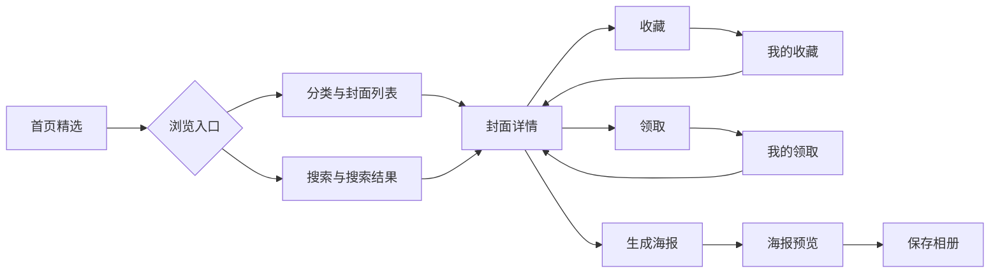
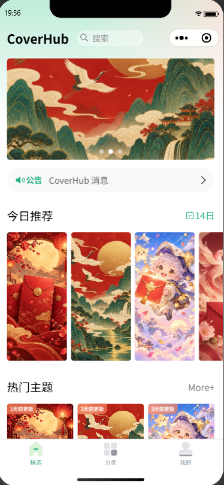
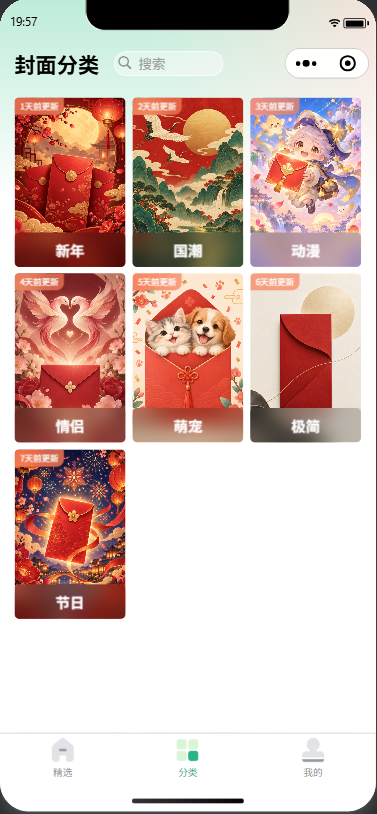
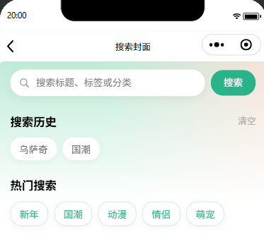
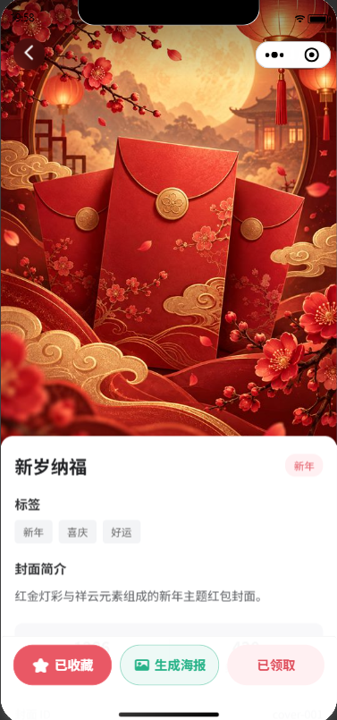
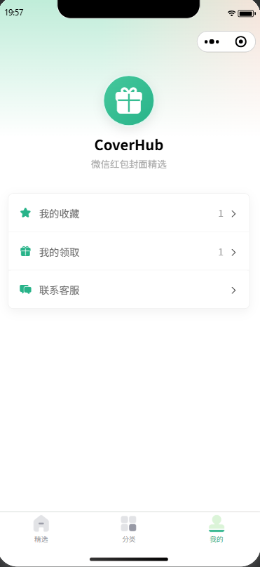
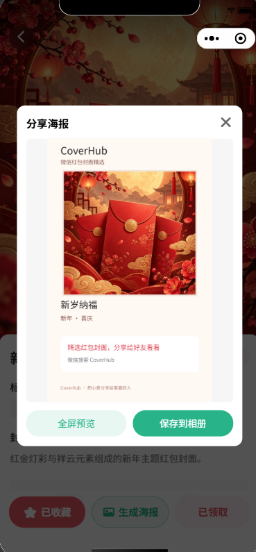
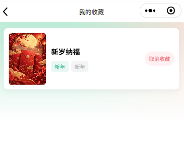
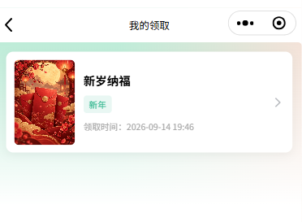
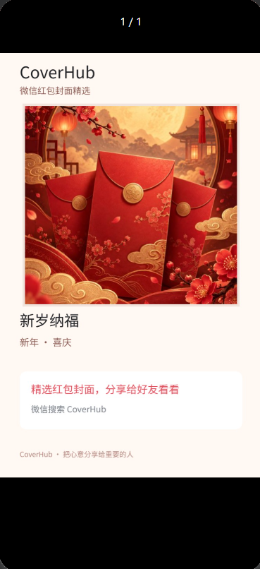

# CoverHub

> 微信红包封面精选小程序

CoverHub 是一个基于 Vue 3、uni-app 和微信小程序 Canvas 开发的前端 MVP，提供红包封面浏览、分类搜索、收藏、领取记录和动态分享海报等功能。

## 项目简介

项目围绕“发现封面 → 查看详情 → 收藏或领取 → 生成分享海报”构建完整演示流程。用户可以从首页精选、分类或搜索进入封面详情，在本地保存收藏与领取状态，并为当前封面生成、预览和保存分享海报。

当前版本使用本地 Mock 数据和项目内图片资源，不依赖远程后端，适合在微信开发者工具中展示前端页面组织、状态处理、本地持久化与 Canvas 绘制能力。

## 功能特性

- 首页 Banner、今日推荐与热门主题
- 封面分类浏览和列表分页加载
- 按标题、标签、分类名称搜索封面
- 搜索历史持久化、去重与清空
- 封面详情、Swiper 切换、相邻图片预加载与分享
- 封面收藏、取消收藏及状态持久化
- 本地领取确认、领取状态与领取时间记录
- 我的收藏与我的领取列表
- Canvas 动态分享海报
- 海报预览、保存相册及权限异常提示
- Loading、Empty、Error、Retry 与 No More 状态反馈

## 技术栈

| 技术 | 用途 |
| --- | --- |
| Vue 3 | Composition API 页面逻辑与响应式状态 |
| uni-app | 微信小程序跨端开发框架 |
| 微信小程序 | 当前主要运行和演示平台 |
| uni-ui | 图标、加载状态、日期等基础组件 |
| JavaScript | 业务逻辑与本地数据访问层 |
| SCSS | 页面样式与主题变量 |
| Canvas | 动态分享海报绘制和导出 |
| uni Storage | 收藏、领取记录与搜索历史持久化 |
| Git | 版本管理 |

## 项目亮点

### 1. 当前封面驱动的 Canvas 分享海报

- 使用详情页当前 Swiper 项作为海报数据源，切换封面后生成内容同步变化。
- 通过图片宽高计算等比 cover 裁切区域，避免主图拉伸。
- 根据标题行数动态调整信息区布局，并对分类和标签进行展示层去重。
- 使用 `canvasToTempFilePath` 导出海报，支持全屏预览和保存相册。
- 对图片加载、Canvas 绘制、导出超时和相册权限异常提供反馈与收尾处理。

### 2. 轻量本地状态持久化

- 收藏仅保存唯一封面 ID，避免重复存储完整业务对象。
- 领取记录保存 `coverId` 与 `claimedAt`，同一封面只保留一条记录。
- 搜索历史支持清理空格、忽略大小写去重、限制数量和一键清空。
- Storage 工具对缺失、类型错误和重复数据进行基础容错。

### 3. 明确的页面状态反馈

关键列表和详情页区分 Loading、Empty、Error、Retry 与 No More 状态，异步流程通过 `try/catch/finally` 结束 Loading，减少空白页和状态悬挂。

### 4. 安全的分类分页追加

分类列表保留页码与 pageSize 机制，通过加载锁阻止快速触底重复请求，并在追加前按封面 ID 去重；最后一页切换为 No More 状态。

### 5. 本地 Mock 数据访问层

页面通过 `api/apis.js` 提供的 Promise API 获取数据，再由该模块访问 `mock/data.js`。页面不直接耦合 Mock 文件内部结构，后续替换数据源时可以继续保留页面调用方式。

## 业务流程



## 项目结构

```text
coverhub-miniapp/
├── api/                 # Promise 风格的数据访问层
├── common/              # 公共样式和现有静态资源
├── components/          # 导航栏、标题、主题卡片等组件
├── docs/
│   └── screenshots/     # 项目真实截图预留目录
├── mock/                # 本地封面、分类、推荐和公告数据
├── pages/
│   ├── index/           # 首页精选
│   ├── classify/        # 封面分类
│   ├── classList/       # 分类分页列表
│   ├── search/          # 搜索与搜索历史
│   ├── preview/         # 详情、收藏、领取与分享海报
│   ├── favorite/        # 我的收藏
│   ├── claim/           # 我的领取
│   ├── user/            # 个人中心
│   └── notice/          # 公告详情
├── static/              # 封面图和 TabBar 图标
├── uni_modules/         # 项目使用的 uni-ui 组件
├── utils/               # 收藏、领取、时间和系统工具
├── pages.json           # 页面与 TabBar 配置
├── manifest.json        # uni-app 与微信小程序配置
└── Readme.md
```

## 项目截图

| 首页 | 分类 |
| --- | --- |
|  |  |

| 搜索 | 封面详情 |
| --- | --- |
|  |  |

| 个人中心 | Canvas 分享海报 |
| --- | --- |
|  |  |

| 我的收藏 | 我的领取 |
| --- | --- |
|  |  |

### 海报全屏预览



## 本地运行

1. 克隆仓库：

   ```bash
   git clone https://github.com/lwx1224567/coverhub-miniapp.git
   ```

2. 使用 HBuilderX 打开项目根目录。
3. 根据本地开发环境，在 `manifest.json` 的微信小程序配置中确认可用 AppID。
4. 确保微信开发者工具已经安装并开启服务端口。
5. 在 HBuilderX 中选择“运行 → 运行到小程序模拟器 → 微信开发者工具”。
6. 等待编译完成后，在微信开发者工具中重新编译并体验业务流程。

项目没有配置 npm、pnpm 或 yarn 启动脚本，请不要使用 `npm run dev`。编译产物位于 `unpackage/`，该目录已被 Git 忽略。

## 数据说明与功能边界

- 当前版本使用 `mock/data.js` 和 `static/covers/` 中的本地资源演示完整前端流程。
- 收藏 ID、领取记录和搜索历史保存在当前设备的 uni Storage 中，不支持跨设备同步。
- “领取”仅表示本地 Demo 业务状态，不会调用真实微信红包封面领取接口，也不会改变 Mock 库存。
- 项目未接入登录、支付、uniCloud、云函数、数据库或后台管理系统。
- Canvas 海报不包含真实小程序码或服务端生成的二维码。

## 二次开发说明

CoverHub 并非完全从零开发。本项目基于开源 uni-app 壁纸小程序进行二次开发：

- 基线仓库：[white10205/Uniapp-Vue3-Shrimp-Wallpaper](https://github.com/white10205/Uniapp-Vue3-Shrimp-Wallpaper)
- 原项目源码链接：[qingnian8/univue3](https://gitee.com/qingnian8/univue3)
- 本仓库最早 Git 提交作者：沈仁东

CoverHub 在原有页面骨架基础上完成的主要工作包括：

- 将壁纸业务重构为微信红包封面精选业务。
- 将原远程接口替换为本地 Mock 数据层和本地图片资源。
- 新增搜索、搜索历史、收藏和领取记录。
- 完成个人中心与我的收藏、我的领取数据闭环。
- 新增由当前封面驱动的 Canvas 动态分享海报、预览与保存能力。
- 补充分页去重、加载与空状态、错误反馈、Storage 异常容错。
- 修复原项目中的时间计算、条件编译、下载参数和基础运行问题。

感谢原项目作者和开源项目提供的基础实现。本仓库的展示与说明不会将原项目基础代码声明为完全原创成果。

## 项目状态

当前版本定位为前端 MVP / Demo，已完成封面浏览、搜索、收藏、领取记录和分享海报的主要闭环。项目用于学习、演示和前端求职作品展示，不宣称达到生产级可用标准。
